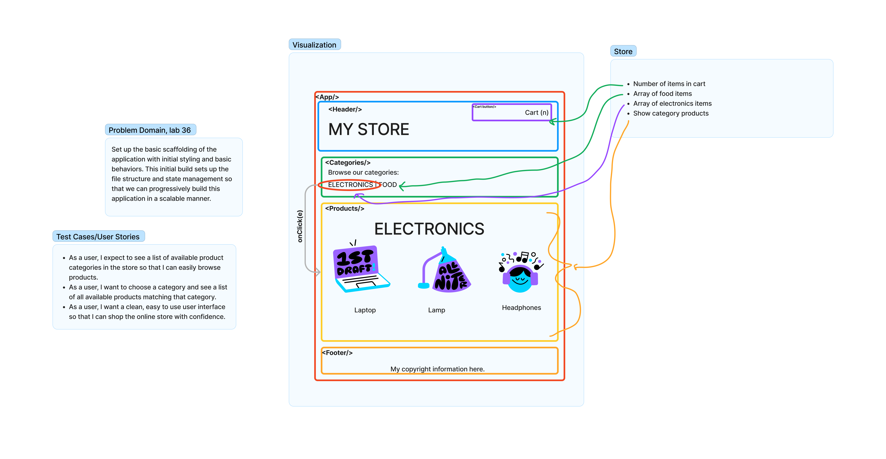

# Virtual Storefront

Phase 1 Buildout: To setup the basic scaffolding of the application with initial styling and basic behaviors. This initial build sets up the file structure and state management so that we can progressively build this application in a scalable manner

Technical Requirements:

- Create a visually appealing site using Material UI.
- Use a Redux Store to manage the state of categories and items in the store.
- Display a list of categories from state.
- When the user selects (clicks on) a category:
  - Identify that category as selected (change of class/display).
  - Show a list of products associated with the category
  
Phase 2 Buildout: Continue work on the e-Commerce storefront, breaking up the store into multiple reducers and sharing functionality/data between components.

In phase 2, we will be adding the “Add to Cart” feature to our application, which will allow our users to not only browse items in the store, but also select them and have them persist in their “shopping cart” for later purchase.

- As a user, I want to choose from products in the list and add them to my shopping cart.
- As a user, I want to see the products that I’ve added to my shopping cart in a growing list on the side of the page”.
- As a user, I want to change the quantity of items I intend to purchase in the header. i.e. CART (1)
- As a user, I want to be able to remove an item from my shopping cart.

Application Flow:

- User sees a list of categories.
- Chooses a category and sees a list of products.
- Clicks the “Add to Cart” button on any product.
- Sees a list of all products in the <SimpleCart /> side menu.
- Clicks the delete button on an item and sees the item removed (see stretch goals for this lab).
- Changes the cart total in the header. If two different products are in the cart you should see: CART (2)